<!-- ═══════════════════════════════════════════════════════════════ -->

<!--                         HEADER                                  -->

<!-- ═══════════════════════════════════════════════════════════════ -->

<p align="center">
  
</p>

<!-- ═══════════════════════════════════════════════════════════════ -->

<!--                    ANIMATED TAGLINE                             -->

<!-- ═══════════════════════════════════════════════════════════════ -->

<p align="center">
  
</p>

<!-- ═══════════════════════════════════════════════════════════════ -->

<!--                         SOCIALS                                 -->

<!-- ═══════════════════════════════════════════════════════════════ -->

<p align="center">
  <a href="https://linkedin.com/in/akarshkumar06">
    
  </a>
  &nbsp;
  <a href="mailto:akarsh.kr2006@gmail.com">
    
  </a>
  &nbsp;
  <a href="https://instagram.com/akarsh.kr.33167">
    
  </a>
  &nbsp;
  
</p>

---

# 👋 About Me

🎓 **Second-year Computer Science student** at **IILM University, Greater Noida**

💻 Building a strong foundation in **C, Java, Python, DSA and DBMS**.

🤖 Exploring **Artificial Intelligence, Machine Learning and Data Science** through hands-on projects.

📊 Working with **NumPy, Pandas, Matplotlib and Scikit-learn** for data analysis and machine learning.

🗄️ Interested in **database systems, SQL and backend development**.

🧠 Focused on strengthening my **problem-solving skills and core computer science fundamentals**.

🌱 **Learning by building, experimenting and improving.**

---

# 🚀 What I'm Currently Exploring

<p align="center">

| 🧠 Area             | 🎯 Focus                                              |
| ------------------- | ----------------------------------------------------- |
| 🤖 **AI / ML**      | Machine Learning, predictive models & AI applications |
| 📊 **Data Science** | Data analysis, visualization & model evaluation       |
| 🧩 **DSA**          | Problem solving, algorithms & coding practice         |
| 🗄️ **DBMS**        | SQL, database design & database applications          |
| 💻 **Programming**  | C, Java & Python                                      |
| 🌐 **Development**  | Web technologies & backend fundamentals               |

</p>

---

# 🛠️ Tech Stack

### 🤖 AI / ML & Data Science

<p>


</p>

### 💻 Programming

<p>


</p>

### 🗄️ Databases

<p>


</p>

### 🌐 Web Development

<p>


</p>

### ⚙️ Tools & Version Control

<p>


</p>

---

# 📌 Featured Projects

### 🏠 House Price Prediction

Machine learning project focused on predicting house prices using regression techniques and data analysis.

**Focus:** `Machine Learning` `Regression` `Python` `Jupyter Notebook`

[🔗 View Repository](https://github.com/AkarshKumar1/House_Price_Prediction_using_Advanced_Regression)

---

### 🎬 Movie Recommendation

A recommendation-focused project exploring how user/movie data can be used to provide movie suggestions.

**Focus:** `PHP` `Recommendation Systems` `Web Development`

[🔗 View Repository](https://github.com/AkarshKumar1/Movie_Recommendation)

---

### ₿ Bitcoin Sentiment Analysis

A data science project exploring sentiment analysis around Bitcoin-related information and data.

**Focus:** `Python` `NLP` `Sentiment Analysis` `Data Science`

[🔗 View Repository](https://github.com/AkarshKumar1/Bitcoin_Sentiment_Analysis)

---

### 🎓 Student Performance Prediction

A predictive analytics project focused on analyzing and predicting student performance.

**Focus:** `PHP` `Prediction` `Data Analysis`

[🔗 View Repository](https://github.com/AkarshKumar1/Student_Performance_Prediction)

---

### 🤖 DeepThought Reflection Agent

An AI-oriented project exploring agent-based workflows and reflective reasoning.

**Focus:** `Python` `AI` `Agents`

[🔗 View Repository](https://github.com/AkarshKumar1/DeepThought_Reflection_Agent)

---

### 📈 Trading Bot

A Python project exploring automated trading concepts and programmatic decision-making.

**Focus:** `Python` `Automation` `Trading`

[🔗 View Repository](https://github.com/AkarshKumar1/Trading_Bot)

---

# 📊 GitHub Statistics

<p align="center">
  
  &nbsp;&nbsp;
  
</p>
---

## 📈 Contribution Activity

<p align="center">
  
</p>

---

# 🕹️ A Little About My Coding Journey

```text
              ┌──────────────────────┐
              │  Learn the Concept   │
              └──────────┬───────────┘
                         │
                         ▼
              ┌──────────────────────┐
              │   Write the Code    │
              └──────────┬───────────┘
                         │
                         ▼
              ┌──────────────────────┐
              │    Debug & Test     │
              └──────────┬───────────┘
                         │
                         ▼
              ┌──────────────────────┐
              │   Build a Project   │
              └──────────┬───────────┘
                         │
                         ▼
              ┌──────────────────────┐
              │      Improve 🚀     │
              └──────────────────────┘
```

> 🎮 **Game Over? Never. Just Debug and Try Again.**

---

# 🐍 GitHub Contribution Game

<p align="center">
  <picture>
    <source
      media="(prefers-color-scheme: dark)"
      srcset="https://raw.githubusercontent.com/AkarshKumar1/AkarshKumar1/output/github-contribution-grid-snake-dark.svg"
    />
    <source
      media="(prefers-color-scheme: light)"
      srcset="https://raw.githubusercontent.com/AkarshKumar1/AkarshKumar1/output/github-contribution-grid-snake.svg"
    />
    
  </picture>
</p>

<p align="center">
  <b>Every contribution is another step forward 🚀</b>
</p>
---

# 🎯 2026 Goals

* [ ] 🧩 Strengthen DSA & problem-solving skills
* [ ] 🤖 Build more AI/ML projects
* [ ] 🗄️ Develop practical DBMS projects
* [ ] 📊 Improve Data Science skills
* [ ] 💻 Strengthen C, Java & Python fundamentals
* [ ] 🚀 Build projects that solve practical problems
* [ ] 🤝 Contribute to collaborative projects
* [ ] 📚 Prepare for technical interviews & internships

---

# 🤝 Let's Connect

<p align="center">
  <a href="https://linkedin.com/in/akarshkumar06">
    
  </a>
  &nbsp;
  <a href="mailto:akarsh.kr2006@gmail.com">
    
  </a>
  &nbsp;
  <a href="https://github.com/AkarshKumar1">
    
  </a>
</p>

<p align="center">
  <i>Learning today. Building tomorrow. 🚀</i>
</p>

<!-- ═══════════════════════════════════════════════════════════════ -->

<!--                         FOOTER                                  -->

<!-- ═══════════════════════════════════════════════════════════════ -->

<p align="center">
  
</p>
